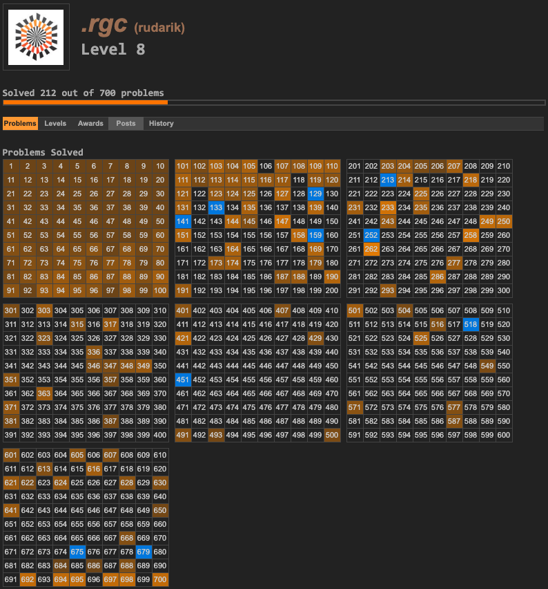

# Project Euler 
<https://projecteuler.net/about>

Project Euler problems are a fun and enlightening way to learn both math and programming languages. Publishing code or solutions destroys the purpose of PE, so this is limited to sharing basic mathematical or programming theory that can shed some light to the problems. I've linked some of the articles I have come across and listed problems they could be relevant for. They are mostly Wikipedia articles. 

Search for a problem number and see if you are lucky!

My current progress: 

* [Alternating Permutation](https://en.wikipedia.org/wiki/Alternating_permutation)
Problem 709: "Even Stevens"

* [Berlekamp-Massey Algorithm](https://en.wikipedia.org/wiki/Berlekamp%E2%80%93Massey_algorithm)

* [Bernoulli Trial](https://en.wikipedia.org/wiki/Bernoulli_trial)
Problem 267: "Billionaire"

* [Bezier Curve](https://en.wikipedia.org/wiki/B%C3%A9zier_curve)
Problem 363: "Bezier curves"

* [Binary Search](https://en.wikipedia.org/wiki/Binary_search_algorithm)

* [Binomial Coefficient](https://en.wikipedia.org/wiki/Binomial_coefficient)
Problem 203: "Squarefree Binomial Coefficients", Problem 158: "Exploring strings for which only one character comes lexicographically after its neighbour to the left", Problem 231: "The prime factorisation of binomial coefficients"

* [Catalan Number](https://en.wikipedia.org/wiki/Catalan_number)

* [Chinese Remainder Theorem](https://en.wikipedia.org/wiki/Chinese_remainder_theorem)
Problem 134: "Prime pair connection", Problem 271: "Modular Cubes, part 1", Problem 451: "Modular inverses"

* [Cyclic Number](https://en.wikipedia.org/wiki/Cyclic_number)
Problem 358: "Cyclic numbers"

* [Cycloid](https://en.wikipedia.org/wiki/Cycloid)
Problem 525: "Rolling ellipse"

* [Decimal Representation](https://en.wikipedia.org/wiki/Decimal_representation)
Problem 183: "Maximum product of parts"

* [Dijkstra's Algorithm](https://en.wikipedia.org/wiki/Dijkstra%27s_algorithm)
Problem 83: "Path sum, four ways" 

* [Diophantine Equation](https://en.wikipedia.org/wiki/Diophantine_equation)
Problem 100: "Arranged probability"

* [Divisibility Rule](https://en.wikipedia.org/wiki/Divisibility_rule)
Problem 491: "Double pandigital number divisible by 11"

* [Divisor Function](https://en.wikipedia.org/wiki/Divisor_function)
Problem 211: "Divisor Square Sum", Problem 429: "Sum of squares of unitary divisors", Problem 501: "Eight Divisors"

* [Dynamic Programming](https://en.wikipedia.org/wiki/Dynamic_programming)
Problem 178: "Step Numbers", Problem 191: "Prize Strings", Problem 249: "Prime Subset Sums", Problem 250: "250250", Problem 329: "Prime Frog", Problem 706: "3-Like Numbers", Problem 215: "Crack-free Walls"

* [Euclidean Algorithm](https://en.wikipedia.org/wiki/Euclidean_algorithm)
Problem 700: "Eulercoin"

* [Euler Numbers](https://en.wikipedia.org/wiki/Euler_number)

* [Faulhaber's Formula](https://en.wikipedia.org/wiki/Faulhaber%27s_formula)

* [Fibonacci Numbers](https://en.wikipedia.org/wiki/Fibonacci_number)
Problem 2: "Even Fibonacci numbers", Problem 104: "Pandigital Fibonacci ends", Problem 230: "Fibonacci words"

* [Gamma Function](https://en.wikipedia.org/wiki/Gamma_function)

* [Generating Function](https://en.wikipedia.org/wiki/Generating_function)
Problem 137: "Fibonacci golden nuggets", Problem 140: "Modified Fibonacci golden nuggets"

* [Geometric Series](https://en.wikipedia.org/wiki/Geometric_series)
Problem 518: "Prime triples and geometric sequences"

* [Heron's Formula](https://en.wikipedia.org/wiki/Heron%27s_formula)
Problem 102: "Triangle containment"

* [Hungarian Algorithm](https://en.wikipedia.org/wiki/Hungarian_algorithm)
Problem 345: "Matrix sum"

* [Inclusion-exclusion Principle](https://en.wikipedia.org/wiki/Inclusion%E2%80%93exclusion_principle)

* [Incomplete gamma function](https://en.wikipedia.org/wiki/Incomplete_gamma_function)
Problem 697: "Randomly Decaying Sequence"

* [Interpolation](https://en.wikipedia.org/wiki/Interpolation)
Problem 101: "Optimum polynomial"

* [Kruskal's Algorithm](https://en.wikipedia.org/wiki/Kruskal%27s_algorithm)
Problem 107: "Minimal network"

* [Lagrange Multiplier](https://en.wikipedia.org/wiki/Lagrange_multiplier)
Problem 190: "Maximising a weighted product"

* [Lambert Series](https://en.wikipedia.org/wiki/Lambert_series)
Problem 722: "Slowly converging series"

* [Langton's Ant](https://en.wikipedia.org/wiki/Langton%27s_ant)
Problem 349: "Langton's Ant"

* [Lucas Number](https://en.wikipedia.org/wiki/Lucas_number)
Problem 209: "Circular Logic"

* [Maximum subarray problem](https://en.wikipedia.org/wiki/Maximum_subarray_problem#Kadane's_algorithm)
Problem 213: "Searching for a maximum-sum subsequence"

* [Memoization](https://en.wikipedia.org/wiki/Memoization)

* [Mobius Function](https://en.wikipedia.org/wiki/M%C3%B6bius_function)
Problem 193: "Squarefree Numbers"

* [Modular Exponentiation](https://en.wikipedia.org/wiki/Modular_exponentiation)
Problem 304: "Primonacci"

* [Multinomial Coefficient](https://en.wikipedia.org/wiki/Multinomial_theorem)
Problem 113: "Non-bouncy numbers"

* [Multiplicative Function](https://en.wikipedia.org/wiki/Multiplicative_function)
Problem 675: "2^w(n)"

* [Nim](https://en.wikipedia.org/wiki/Nim)
Problem 301: "Nim"

* [Partitions](https://en.wikipedia.org/wiki/Partition_(number_theory))
Problem 76: "Counting Summations", Problem 77: "Prime summations", Problem 78: "Coin partitions", Problem 181: "Investigating in how many ways objects of two different colours can be grouped"

* [Pascal's Triangle](https://en.wikipedia.org/wiki/Pascal%27s_triangle)
Proble, 148: "Exploring Pascal's triangle"

* [Pell's Equation](https://en.wikipedia.org/wiki/Pell%27s_equation)
Problem 321: "Swapping Counters"

* [Pick's Theorem](https://en.wikipedia.org/wiki/Pick%27s_theorem)
Problem 504: "Square on the Inside"

* [Primality Test](https://en.wikipedia.org/wiki/Primality_test)
Problem 146: "Investigating a Prime Pattern" 

* [Prime-Counting Function](https://en.wikipedia.org/wiki/Prime-counting_function)
Problem 609: "Pi sequences"

* [Primitive Root Modulo n](https://en.wikipedia.org/wiki/Primitive_root_modulo_n)
Problem 421: "Prime factors of n^15+1"

* [Probability Density Function](https://en.wikipedia.org/wiki/Probability_density_function)
Problem 394: "Eating pie"

* [Pythagorean Triple](https://en.wikipedia.org/wiki/Pythagorean_triple)
Problem 138: "Special isosceles triangles", Problem 139: "Pythagorean tiles", Problem 142: "Perfect Square Collection", Problem 218: "Perfect right-angled triangles"

* [Recurrence Relation](https://en.wikipedia.org/wiki/Recurrence_relation)
Problem 258: "A lagged Fibonacci sequence", Problem 710: "One Million Members", Problem 440: "GCD and Tiling"

* [Refraction](https://en.wikipedia.org/wiki/Refraction)
Problem 607: "Marsh Crossing"

* [Riffle Shuffle](http://mathworld.wolfram.com/RiffleShuffle.html)
Problem 622:  "Riffle Shuffles".

* [Sieve of Eratosthenes](https://en.wikipedia.org/wiki/Sieve_of_Eratosthenes)
Problem 196: "Prime triplets"

* [Square Pyramidal Number](https://en.wikipedia.org/wiki/Square_pyramidal_number)
Problem 401: "Sum of squares of divisors"

* [Specular Reflection](https://en.wikipedia.org/wiki/Specular_reflection)
Problem 144: "Investigating multiple reflections of a laser beam" 

* [Sum of Squares](https://en.wikipedia.org/wiki/Sum_of_two_squares_theorem)
Problem 233: "Lattice points on a circle"

* [Symmetric Polynomial](https://en.wikipedia.org/wiki/Symmetric_polynomial)

* [Tonelli-Shanks Algorithm](https://en.wikipedia.org/wiki/Tonelli%E2%80%93Shanks_algorithm)
Problem 216: "Investigating the primality of numbers of the form 2n^2-1"

* [Totient Function](https://en.wikipedia.org/wiki/Euler%27s_totient_function)
Problems 69: "Totient maximum", Problem 70: "Totient permutation", Problem 214: "Totient chains", Problem 243: "Resilience", Problem 351: "Hexagonal orchards", Problem 512: "Sums of totients of powers", Problem 516: "5-smooth totients"

* [Trailing Zero](https://en.wikipedia.org/wiki/Trailing_zero)
Problem 160: "Factorial trailing digits"

* [Turan graph](https://en.wikipedia.org/wiki/Tur%C3%A1n_graph)
Problem 713: "Turan's water heating system"

* [Random Sums of Random Variables](http://www.math.unl.edu/~sdunbar1/ProbabilityTheory/Lessons/Conditionals/RandomSums/randsum.shtml)
Problem 389: "Platonic Dice"

* [Recursion](https://en.wikipedia.org/wiki/Recursion_(computer_science))
Problem 118: "Pandigital prime sets"

* [Repunit](https://en.wikipedia.org/wiki/Repunit)
Problem 129: "Repunit divisibility", Problem 130: "Composites with prime repunit property", Problem 132: "Large repunit factors", Problem 132 "Repunit nonfactors"

* [Zeckendorf's Theorem](https://en.wikipedia.org/wiki/Zeckendorf%27s_theorem)
Problem 297: "Zeckendorf Representation", Problem 366: "Stone Game III"
