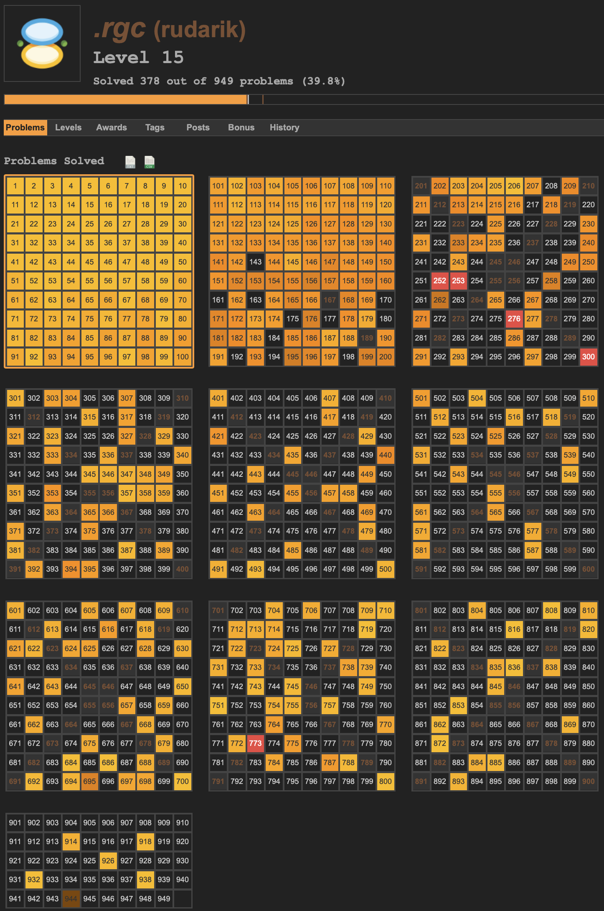

# Project Euler 
<https://projecteuler.net/about>

Project Euler problems are a fun and enlightening way to learn both math and programming languages. Publishing solutions is totally and against the website policy and lame, so this is limited to sharing basic mathematical or programming theory that can shed some light to the problems. I've linked some of the articles I have come across and listed problems they could be relevant for. This is not exhaustive nor fully updated. 

Search for a problem number and see if you are lucky!

My current progress: 

* [Partitions](https://en.wikipedia.org/wiki/Partition_(number_theory))
Problem 76: "Counting Summations", Problem 77: "Prime summations", Problem 78: "Coin partitions". 

* [Totient Function](https://en.wikipedia.org/wiki/Euler%27s_totient_function)
Problems 69: "Totient maximum", Problem 70: "Totient permutation", Problem 214: "Totient chains"

* [Modular Exponentiation](https://en.wikipedia.org/wiki/Modular_exponentiation)

* [Dijkstra's Algorithm](https://en.wikipedia.org/wiki/Dijkstra%27s_algorithm)
Problem 83: "Path sum, four ways" 

* [Diophantine Equation](https://en.wikipedia.org/wiki/Diophantine_equation)
Problem 100: "Arranged probability"

* [Riffle Shuffle](http://mathworld.wolfram.com/RiffleShuffle.html)
Problem 622:  "Riffle Shuffles".

* [Langton's Ant](https://en.wikipedia.org/wiki/Langton%27s_ant)
Problem 349: "Langton's Ant"

* [Sum of squares](https://en.wikipedia.org/wiki/Sum_of_two_squares_theorem)
Problem 233: "Lattice points on a circle"

* [Interpolation](https://en.wikipedia.org/wiki/Interpolation)
Problem 101: "Optimum polynomial"

* [Fibonacci Numbers](https://en.wikipedia.org/wiki/Fibonacci_number)
Problem 2: "Even Fibonacci numbers", Problem 104: "Pandigital Fibonacci ends"

* [Cycloid](https://en.wikipedia.org/wiki/Cycloid)
Problem 525: "Rolling ellipse"

* [Dynamic Programming](https://en.wikipedia.org/wiki/Dynamic_programming)

* [Pythagorean Triple](https://en.wikipedia.org/wiki/Pythagorean_triple)

* [Geometric Series](https://en.wikipedia.org/wiki/Geometric_series)
